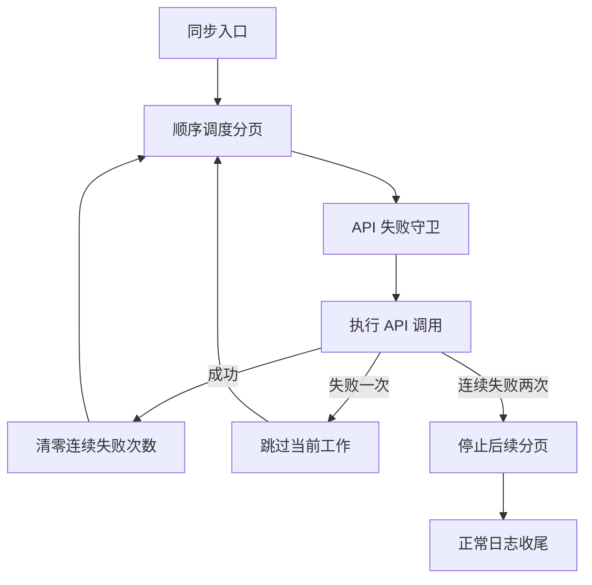

# 连续 API 失败终止同步

Feature Name: stop-sync-after-api-failures
Updated: 2026-08-20

## Description

标签同步使用一个任务级 API 失败守卫跟踪连续失败次数。所有标签同步 API 请求共享该守卫，成功请求清零计数，第二次连续失败产生停止信号。分页任务顺序调度，使停止信号能够阻止后续分页开始执行。作品摘要进入标签计算前执行内容过滤，排除 Discussion 类型中带有“小作品”标签和正文少于 50 个字符的作品。采集流程根据作品类型与筛选标签写入标准化来源。

## Architecture

## Components and Interfaces

- `ConsecutiveApiFailureGuard.call`：执行 API 操作、校验响应并维护连续失败次数。
- `SyncStoppedAfterApiFailuresError`：向同步调用链传递停止信号。
- `syncDisciplineTagsToSelectedWorks`：接收任务级守卫，对分页内的各项 API 调用应用统一策略。
- `syncSelectedTags`：顺序调度分页并在收到停止信号后正常结束。
- `getTagSyncSkipReason`：根据作品标签和正文长度返回过滤原因。
- `resolveRecordSource`：将作品类型与筛选标签映射为标准化来源。

## Data Models

守卫维护单个整数 `consecutiveFailures`。初始值为零，成功调用写入零，失败调用加一，达到二时抛出停止信号。`DataRecord.source` 保存“实验精选”“黑洞精选”“黑洞小说”或“其他”。

## Correctness Properties

- 任意成功 API 调用后，下一次失败计为一次失败。
- 第二次连续失败完成后，后续分页任务均未启动。
- 已返回成功状态的更新请求不执行补偿或回滚。
- Discussion 类型中带有“小作品”标签的作品不会调用标签更新 API。
- 去除正文两端空白后合计少于 50 个字符的作品不会调用 AI 分析或标签更新 API。

## Error Handling

- 第一次 API 失败由当前作品处理逻辑记录并跳过。
- 第二次连续 API 失败由同步入口捕获并记录停止原因。
- 本地数据库异常继续按运行失败处理，避免将非 API 故障归入连续失败策略。

## Test Strategy

- 验证一次失败后继续执行下一任务。
- 验证成功调用会清零失败计数。
- 验证连续两次失败会抛出停止信号。
- 验证停止信号出现后不会执行后续任务。
- 验证“小作品”标签过滤、正文长度边界和多段正文合并计数。
- 验证来源映射与未知组合回退规则。
- 验证旧数据库来源字段迁移与默认值。

## References

[^1]: `src/services/tagSync.ts` - 标签同步 API 调用与作品更新。
[^2]: `src/scripts/syncSelectedTags.ts` - 标签同步分页调度入口。
